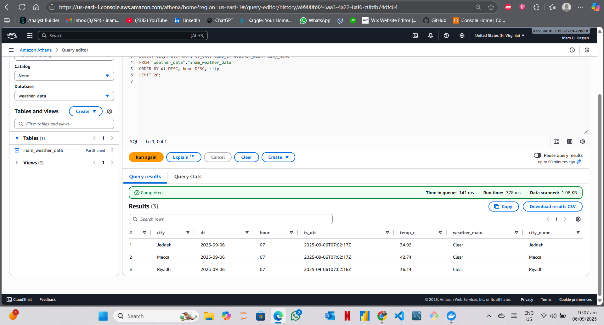
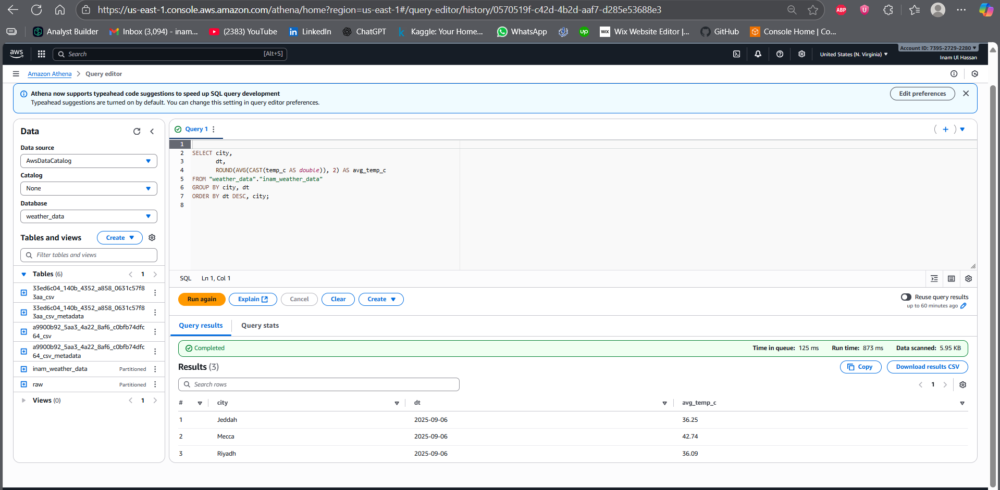

# Weather → S3 → Athena (Serverless ETL)

Serverless data pipeline on AWS: EventBridge (schedule) → Lambda (OpenWeather) → S3 (partitioned) → Glue Crawler (catalog) → Athena (SQL). Optional QuickSight for dashboards.

---

## Tech Stack


---

## Architecture

<p align="center">
  
</p>

---

## What it does
- Ingests weather for **Riyadh, Jeddah, Mecca** hourly (EventBridge → Lambda).
- Stores JSON to S3 with partitions: `raw/city=.../dt=YYYY-MM-DD/hour=HH/...`
- Glue Crawler updates a table in **Glue Data Catalog**.
- Query with **Athena** using standard SQL.
- (Optional) Visualize insights in **QuickSight** dashboards.

---

## Quickstart (Steps I Did)

1. **S3 bucket**: Encrypted, private, blocked public access.
2. **Secrets Manager**: Stored OpenWeather API key securely.
3. **IAM Role** for Lambda:  
   - Policies: `AWSLambdaBasicExecutionRole`  
   - Inline: `secretsmanager:GetSecretValue`, `s3:PutObject`, `s3:ListBucket`
4. **Lambda (Python 3.12)**:  
   - Env variables: `BUCKET`, `SECRET_NAME=openweather/api`, `CITIES=Riyadh,Jeddah,Mecca`, `BASE_PATH=raw`
5. **EventBridge schedule**: Runs every 1 hour (`rate(1 hour)`).
6. **Glue Crawler**: Scans S3 and updates table `weather_data.inam_weather_data`.
7. **Athena**: Set query result location in S3, run SQL queries.

---

## Example Athena Queries & Results

### Raw Weather Data
```sql
SELECT city, dt, hour, ts_utc, temp_c, weather_main, city_name
FROM "weather_data"."inam_weather_data"
ORDER BY dt DESC, hour DESC, city
LIMIT 20;
```
<p align="center">
  
</p>

---

### Daily Average Temperature per City
```sql
SELECT city, dt,
       ROUND(AVG(CAST(temp_c AS double)), 2) AS avg_temp_c
FROM "weather_data"."inam_weather_data"
GROUP BY city, dt
ORDER BY dt DESC, city;
```
<p align="center">
  
</p>

---

### Top Hottest Cities per Day
```sql
SELECT dt, city,
       MAX(CAST(temp_c AS double)) AS max_temp_c
FROM "weather_data"."inam_weather_data"
GROUP BY dt, city
ORDER BY dt DESC, max_temp_c DESC
LIMIT 10;
```
<p align="center">
  
</p>

---

## Future Work
- Add **QuickSight dashboards** for visualization.
- Extend Lambda to fetch **more cities globally**.
- Store data in **Parquet** for cost optimization in Athena.
- Automate with **CI/CD pipeline** (GitHub Actions + Terraform).

---

👤 Author: Inam Ul Hassan  
📌 Repo: [weather-to-s3-athena](https://github.com/Inam0217/weather-to-s3-athena)
